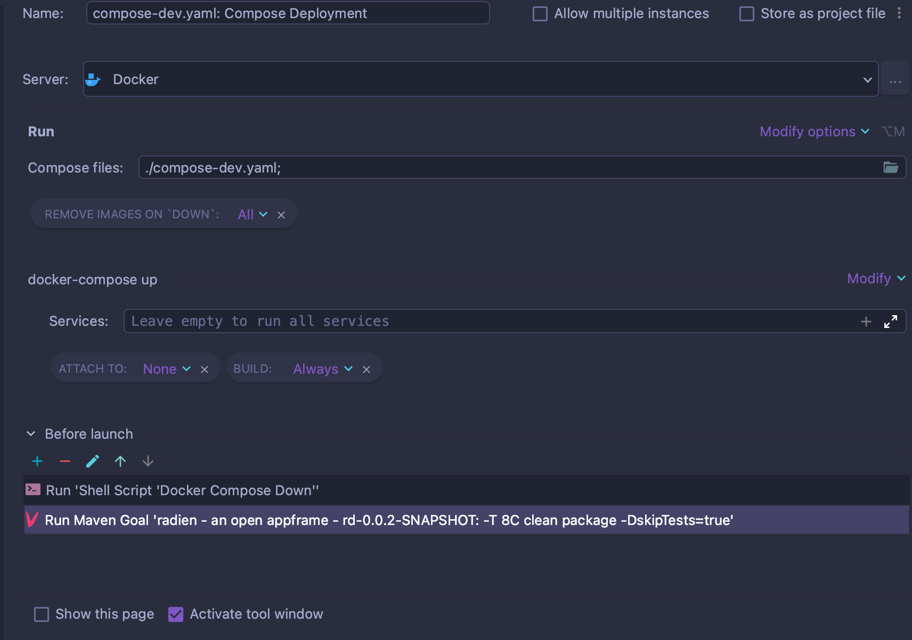
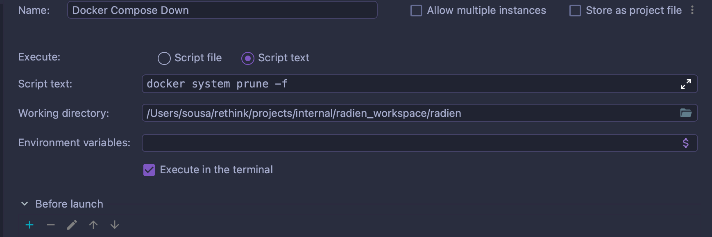

# radien

[](https://sonar.radien.io/dashboard?id=io.radien%3Aappframe)


#TomEE Download page:
http://tomee.apache.org/download-ng.html

#TomEE 8.0.5 Download link: 
https://www.apache.org/dyn/closer.cgi/tomee/tomee-8.0.5/apache-tomee-8.0.5-plus.zip

# Local Environment Setup

A local docker development environment is already provided within ```compose-dev.yaml```.

This configuration uses Dockerfiles and configurations from both **tomee/local** and **keycloak/local**

For the Keycloak Service, the image provided in the repository is compatible with systems not running a 
**arm64** architecture (i.e. M1 Macbooks). In order to support this architecture please use the following image instead:
- sleighzy/keycloak:16.1.0-arm64

## Deployment
Please use the following deployment configuration, or similar:



Ensure that **Remove Images on 'DOWN': All**, **ATTACH TO: None** and **BUILD: Always** are set.

Feel free to use any other deployment methods you feel comfortable with. 
The main points to be aware is that if the target is a Docker Container, the changed code must be
repackaged to ensure the deployment of the changes.

## Debugging
In order to debug any of the services, just create a Deployment Configuration of type Remote JVM Debug targeting
the service's Debug Port and run this configuration.

## Initialization
After all services are running, please also execute the initializer by doing the following steps:

- cd initializer
- mvn package
- cd ..
- java -jar initializer/target/initializer-jar-with-dependencies.jar

## Services Configuration

| Service                         |  HTTPS Port  |  HTTP Port  |  DEBUG Port  |
|---------------------------------|:------------:|:-----------:|:------------:|
| User Management Service         |     8441     |    8085     |     8005     |
| Tenant Management Service       |     8442     |    8084     |     8004     |
| Role Management Service         |     8444     |    8083     |     8003     |
| Ticket Management Service       |     8449     |    8088     |     8008     |
| Permission Management Service   |     8445     |    8082     |     8002     |
| Notification Management Service |     8448     |    8087     |     8007     |
| Document Type Management Service |     8447     |    8086     |     8006     |
| Content Management Service      |     8446     |    8081     |     8000     |
| Web                             |     8443     |    8080     |     8001     |
