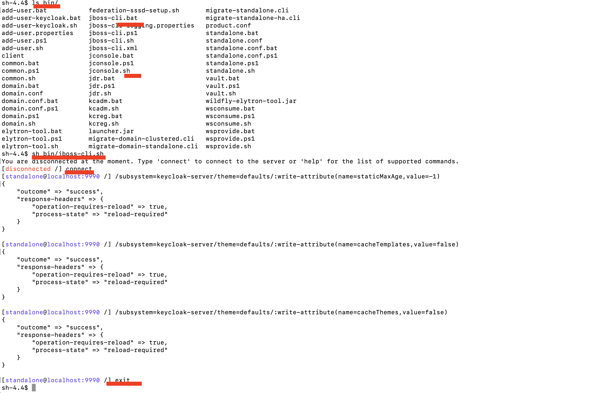

# rd-ms-keycloak-themes
Microservice module for the keycloak theme customization

# Deploy Keycloak custom themes
<pre>
mvn package

## Deploy customized theme jar to the Keycloak server in the component of standalone/deployments
docker cp ./target/keycloakservicethemes.jar [CONTAINERID]:/opt/jboss/keycloak/standalone/deployments/
docker cp ./target/keycloakservicethemes.jar d65a2f043882:/opt/jboss/keycloak/standalone/deployments/
</pre>

<pre>
Keycloak implements a cache mechanism that it is very useful 
in production instances to improve the overall system performances 
when deploying customized themes. 

When theme caching is enabled the Keycloak server always have to restart
to see the changes that made to Freemarker templates. 
This makes annoying each time theme changes needed to restart, 
but fortunately there is  solution that one can adopt to solve the issue.

<pre>
Theme cache customization
1) standalone.xml
    - Account
    - Admin
    - Email
    - Login
2) 1) standalone-ha.xml
    - Account
    - Admin
    - Email
    - Login
    - Welcome page
</pre>

i.e. disable the theme in caching in the file standalone.xml file 
of theme tag.

<pre>
<`theme`>
<`staticMaxAge`>-1<`/staticMaxAge`>
<`cacheThemes`>false<`/cacheThemes`>
<`cacheTemplates`>false<`/cacheTemplates`>
...
<`/theme`>
</pre>

## Disabling theme caching can be done in three ways;
Standalone:
- Make changes in the standalone.xml/standalone-ha.xml file 
Manually change the configurations in the .xml file(s) based on the theme to customize

Docker container:
- By command
docker cp ./src/main/config/standalone.xml [CONTAINERID]:/opt/jboss/keycloak/standalone/configuration/standalone.xml 

- By script
create a folder in docker container,startup-scripts, i.e. /opt/jboss/startup-scripts/
<pre>
keycloak:
    ....
    volumes:
      - ./src/main/config/*.cli:/opt/jboss/startup-scripts/
</pre>

run the scripts on jboss cli 

- By CLI
/subsystem=keycloak-server/theme=defaults/:write-attribute(name=staticMaxAge,value=-1)
/subsystem=keycloak-server/theme=defaults/:write-attribute(name=cacheTemplates,value=false)
/subsystem=keycloak-server/theme=defaults/:write-attribute(name=cacheThemes,value=false)

    

</pre>