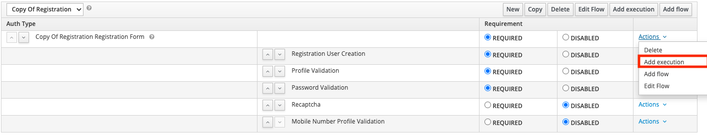
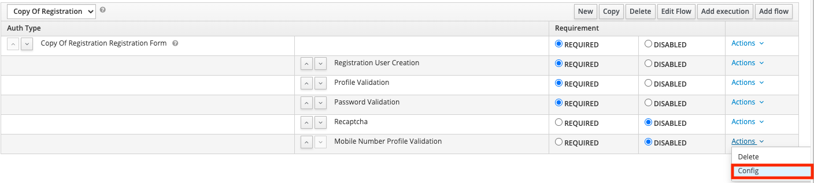
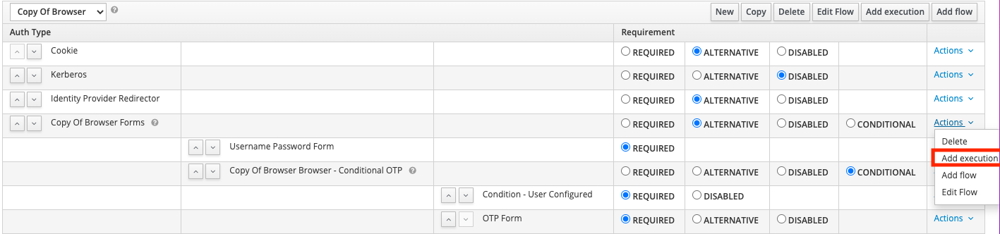
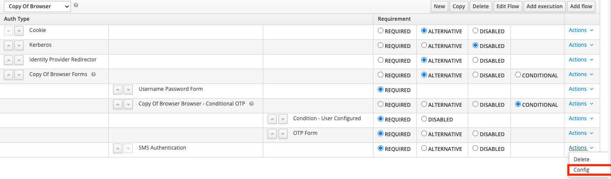

# rd-ms-keycloak-themes
Microservice module for the keycloak theme customization

# Deploy Keycloak custom themes
Refer Dockerfile from keycloak/local

# Development mailhog configuration
Configure email id of admin user "raiden" as admin@dev-mailhog.com, so that it allows us to verify emails
in the url of "http://localhost:8025/"

# Custom Providers
## Mobile Number Validation - Registration
* In order to configure the mobile number validation, a custom authentication flow has to be created. 
You may proceed by duplicating the default Registration flow.
* After this, select **"Add Execution"**: 

* Select **"Mobile Number Profile Validation"**.
* Change the Requirement to **Required**
* On the dropdown choose **Config**: 

* Enter any alias to recognize the step by, validate the Regex and Save.
* Navigate to **Bindings**, and set the **Registration** binding to the newly created flow.

## 2FA - SMS Token
* In order to configure the mobile 2-factor-authentication, a custom authentication flow has to be created.
  You may proceed by duplicating the default Browser flow.
* After this, select **"Add Execution"**: 
  
* Select **"SMS Authentication"**.
* Change the Requirement to **Required**
* On the dropdown choose **Config**: 
  
* Validate all available configurations are correct.
* Navigate to **Bindings**, and set the **Registration** binding to the newly created flow.

### Amazon SNS Configuration
The 2FA service uses Amazon SNS to sent text messages. 
Some properties must be configured on the environment in order for this service to work correctly. 
Without these properties the service will only work in Simulation mode - Codes only logged.

**Environment Properties:**
* AWS_REGION
* AWS_ACCESS_KEY_ID
* AWS_SECRET_ACCESS_KEY